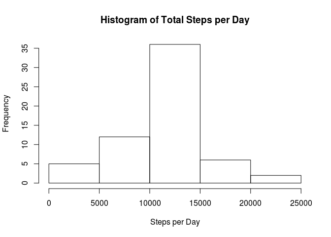

# Reproducible Research: Peer Assessment 1

## Loading and preprocessing the data

Load some libraries.

```r
library(dplyr)
```

```
## 
## Attaching package: 'dplyr'
## 
## The following object is masked from 'package:stats':
## 
##     filter
## 
## The following objects are masked from 'package:base':
## 
##     intersect, setdiff, setequal, union
```

```r
library(lubridate)
```

Load data, convert date and interval to a time format for ease of manipulation later, and convert interval to a decimal for time series plotting without any special packages because this is more straightforward than learning zoo or whatever when all we need is a plot.

```r
activity <- read.csv("activity.csv")
activity <- activity %>%
  mutate(date2 = parse_date_time2(as.character(date), "Y-m-d"))
activity$decint <- (activity$interval %/% 100 + (activity$interval %% 100)/60)*100
```

## What is mean total number of steps taken per day?

Get the total steps per day.

```r
total <- activity %>%
  group_by(date) %>%
  summarize(steps = sum(steps, na.rm = T))
```

Plot a histogram.

```r
hist(total$steps, xlab = "Steps per Day",
     main = "Histogram of Total Steps per Day")
```

 

The mean.

```r
mean(total$steps)
```

```
## [1] 9354.23
```

The median.

```r
median(total$steps)
```

```
## [1] 10395
```

## What is the average daily activity pattern?

Get the mean across days by time period.

```r
total2 <- activity %>%
  group_by(decint) %>%
  summarize(steps = mean(steps, na.rm = T))
```

Plot the time series.

```r
plot(total2$steps ~ total2$decint, type = "l", xaxt = "n",
     main = "Time Series of Mean Steps",
     xlab = "Time",
     ylab = "Mean Steps")
axis(side = 1, at = seq(0,2400,600))
```

 

Find the interval with the maximum average number of steps.

```r
total2 %>% filter(steps == max(steps)) %>%
  transmute(interval = (decint %% 100)*.6 + (decint %/% 100)*100,
  steps = steps)
```

```
## Source: local data frame [1 x 2]
## 
##   interval    steps
## 1      835 206.1698
```

## Imputing missing values

Tabulate the number of NAs in the original data.

```r
table(is.na(activity$steps))
```

```
## 
## FALSE  TRUE 
## 15264  2304
```
Sure is a lot.

Replace all NAs with the mean for that time period since I already calculated it and I'm lazy.

```r
activity$steps2 <- rep(NA, length(activity$steps))
for (i in 1:length(activity$steps2)) {
  ifelse(i > length(total2$steps),
         j <- 1 + (i %% length(total2$steps)),
         j <- i)
  ifelse(is.na(activity$steps[i]),
         activity$steps2[i] <- total2$steps[j],
         activity$steps2[i] <- activity$steps[i])
}
```

Tabulate the number of NAs in the new data.

```r
table(is.na(activity$stepss))
```

```
## Warning in is.na(activity$stepss): is.na() applied to non-(list or vector)
## of type 'NULL'
```

```
## < table of extent 0 >
```

All gone.

Get the total steps per day.

```r
total3 <- activity %>%
  group_by(date) %>%
  summarize(steps = sum(steps2))
```

Rebuild the histogram.

```r
hist(total3$steps, xlab = "Steps per Day",
     main = "Histogram of Total Steps per Day")
```

 

Note that it looks a lot more Gaussian than it did before. It seems a lot of the days that were in the 0-10000 steps per day have moved to the 10000-15000 range.

The new mean.

```r
mean(total3$steps)
```

```
## [1] 10766.19
```

The new median.

```r
median(total3$steps)
```

```
## [1] 10766.19
```

Note that the mean and median are identical to two decimal places now.

## Are there differences in activity patterns between weekdays and weekends?

Define a set of days to be weekends, because it's shorter.

```r
wknds <- c("Saturday", "Sunday")
```

Mutate a variable that says whether the date is a weekend or not.

```r
activity <- activity %>% mutate(day = weekdays(date2) %in% wknds)
activity$day <- factor(activity$day,
                       labels = c("weekday", "weekend"))
```

Get the mean by time period and day.

```r
total4 <- activity %>%
  group_by(decint, day) %>%
  summarize(steps = mean(steps, na.rm = T))
```

Split the data into weekday and weekends.

```r
total4 <- total4 %>% ungroup() %>% transmute(decint = decint,
                                 day = day, steps = steps)
total5 <- total4 %>% filter(day == "weekday")
total6 <- total4 %>% filter(day == "weekend")
```

Plot the time series.

```r
par(mfcol = c(2,1), mar = c(4,4,2,2))
plot(total5$steps ~ total5$decint, type = "l", xaxt = "n",
     main = "Time Series of Mean Steps on Weekdays",
     xlab = "Time",
     ylab = "Mean Steps")
axis(side = 1, at = seq(0,2400,600))

plot(total6$steps ~ total6$decint, type = "l", xaxt = "n",
     main = "Time Series of Mean Steps on Weekends",
     xlab = "Time",
     ylab = "Mean Steps")
axis(side = 1, at = seq(0,2400,600))
```

 
